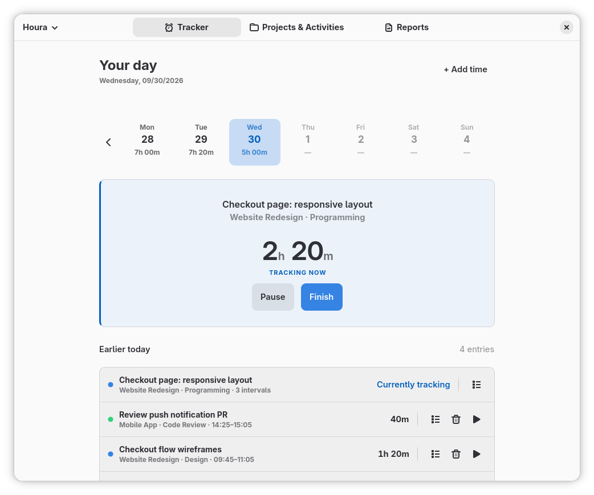
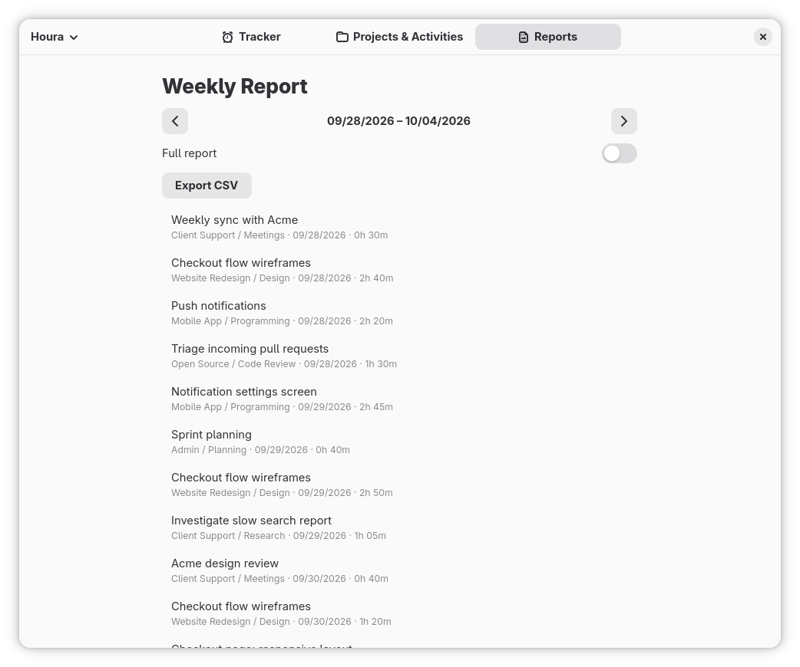
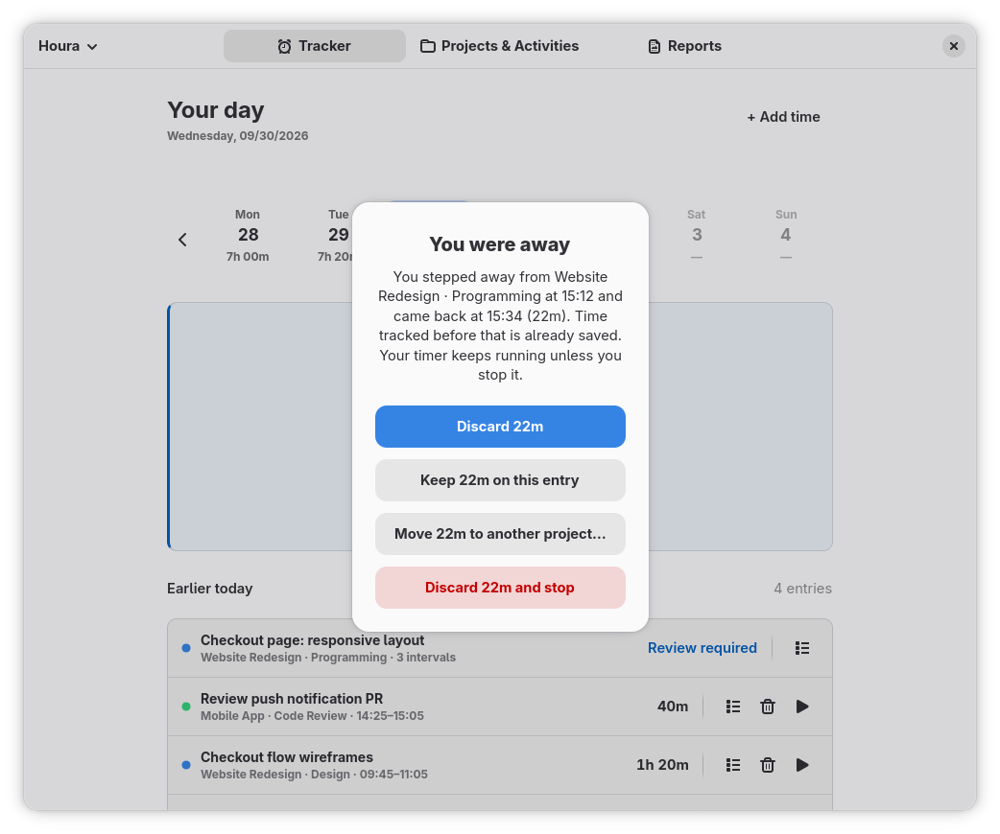
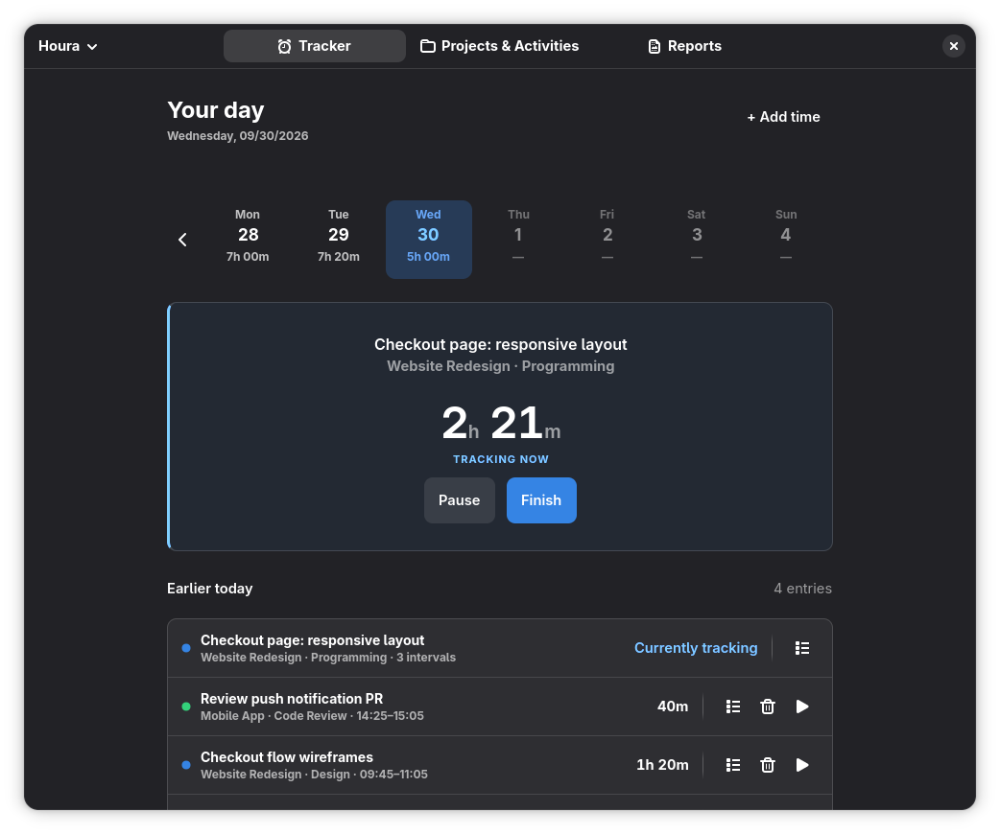

<div align="center">


# Houra

**Know where your hours go**

[](LICENSE)




</div>

Pick a project and an activity, start the timer, and Houra keeps count through breaks,
idle time, suspends and crashes. The running timer stays in GNOME's top bar, so you
can see it and pause it without opening the window.

> [!NOTE]
> Houra is young. I use it every day on my own machine (Fedora 44, GNOME 50, Wayland).
> Every package is installed and checked automatically on the other distributions below,
> but without a GNOME session, so bug reports from other setups are very welcome.

## Features

**Track**
- Start a timer for a project and an activity, with an optional note.
- Pause and resume. A paused timer stays on the same time entry.
- Continue an earlier time entry instead of starting a new one.
- Add time entries by hand for work you did away from the computer.
- One timer at a time: time entries cannot overlap, so each minute counts once
  and a day holds at most 24 hours of tracked time.
- Today's total updates live, and a week strip shows the hours for each day.

**Never lose time**
- When you come back after being idle, Houra asks what to do with the time you were
  away: discard it and keep going, keep it, move it to another project, or discard it
  and stop.
- If Houra or your computer crashes, the active timer is restored from the last
  save, made every 30 seconds.
- The timer is saved before your computer suspends.

**Top bar**
- The timer runs in GNOME's top bar, with a pause/resume button.
- Click it to open Houra. It turns yellow when something needs your review.
- The top-bar extension is installed with Houra and turned on automatically.

**Review and export**
- Weekly report with one row per time entry, or one per tracked interval.
- Export the week as CSV.
- Report for a single time entry, with all its tracked intervals.
- Round finished totals up, to the nearest minute, or down.

**Your data**
- Everything is stored on your computer in SQLite. There is no account.
- Back up to a JSON file and restore from it.

**Speaks your language**
- English, Spanish, Brazilian Portuguese, French, German, Italian, Russian, Japanese,
  Korean and Simplified Chinese.

## Screenshots

| Weekly report | Time you were away | Dark style |
|---|---|---|
|  |  |  |

The timer in GNOME's top bar, next to the clock:


## Install

Houra needs GNOME 49, 50 or 51 on an x86_64 computer. Pick your distribution below.
After installing, start Houra from the Activities overview, then **log out and back in
once** so GNOME Shell loads the top-bar timer. Houra turns the extension on for you.

### Fedora 44

```sh
sudo dnf copr enable majamato/houra
sudo dnf install houra
```

Updates arrive with your regular system updates. On Fedora Silverblue and the other
atomic variants, add the repository and layer the package, then restart:

```sh
sudo curl -fsSL -o /etc/yum.repos.d/houra.repo \
    https://copr.fedorainfracloud.org/coprs/majamato/houra/repo/fedora-44/majamato-houra-fedora-44.repo
rpm-ostree install houra
```

On Fedora 43 or 45, use the [install script](#other-distributions-such-as-opensuse-tumbleweed).

### Ubuntu 26.04 LTS and 26.10

```sh
sudo add-apt-repository ppa:majamato/houra
sudo apt install houra
```

Updates arrive with your regular system updates.

### Debian testing and unstable

Download `houra_X.Y.Z-1_amd64.deb` from the
[latest release](https://github.com/Majamato/houra/releases/latest), then:

```sh
sudo apt install ./houra_*_amd64.deb
```

To update, install the `.deb` of the new release the same way, or use the install
script below instead, which updates with one command.

### Arch Linux, Manjaro, EndeavourOS and other Arch-based distributions

Install [`houra-bin`](https://aur.archlinux.org/packages/houra-bin) from the AUR with
your AUR helper, for example:

```sh
yay -S houra-bin
```

It installs the prebuilt release, so nothing is compiled. Your AUR helper updates it.

### Other distributions, such as openSUSE Tumbleweed

Run this as your normal user, without `sudo`:

```sh
curl -fsSL https://github.com/Majamato/houra/releases/latest/download/install.sh | bash
```

The script downloads the latest release, checks its SHA-256 checksum, and installs
Houra for your user in `~/.local`, with its launcher and top-bar extension. It needs
no root password. If a library is missing, it prints the command that installs it
and changes nothing. Run the same command again to update.

To install for every user on the computer in `/usr/local` instead, run
`curl -fsSL https://github.com/Majamato/houra/releases/latest/download/install.sh | sudo bash -s -- --system`.

The script works on any of the distributions above too. Use either the script or a
package, not both: remove one before switching to the other.

### Uninstall

| Installed with | Remove with |
|---|---|
| COPR | `sudo dnf remove houra && sudo dnf copr remove majamato/houra` |
| PPA | `sudo apt remove houra && sudo add-apt-repository --remove ppa:majamato/houra` |
| `.deb` | `sudo apt remove houra` |
| AUR | `sudo pacman -R houra-bin` |
| Install script | `~/.local/share/houra-installer/install.sh --uninstall` |
| Install script, `--system` | `sudo /usr/local/share/houra-installer/install.sh --system --uninstall` |

Uninstalling keeps your data in `~/.local/share/houra/`. Delete that folder too if
you want to remove it. If you turned on "Open Houra when signing in", the install
script removes that login entry; with a package, turn the setting off before removing
Houra, or delete `~/.config/autostart/io.github.majamato.Houra.desktop`.

To build from source instead, see [CONTRIBUTING.md](CONTRIBUTING.md#build-and-run).

## Quick start

1. Add your projects on the **Projects & Activities** page. Houra starts with a
   General project and a few common activities, such as Programming and Meetings.
2. On the **Tracker** page, choose a project and an activity and press **Start timer**.
   Pause when you take a break, and press **Finish** when the work is done.
3. Open **Reports** at the end of the week to check your hours and export them as CSV.

### Keyboard shortcuts

| Shortcut | Action |
|---|---|
| <kbd>Ctrl</kbd>+<kbd>Space</kbd> | Start, pause or resume the timer |
| <kbd>Ctrl</kbd>+<kbd>S</kbd> | Finish the timer |
| <kbd>Ctrl</kbd>+<kbd>N</kbd> | Add a time entry by hand |
| <kbd>Ctrl</kbd>+<kbd>,</kbd> | Preferences |
| <kbd>Ctrl</kbd>+<kbd>Q</kbd> | Quit |

## Where your data lives

- **Database:** `~/.local/share/houra/houra.sqlite3` (or `$XDG_DATA_HOME/houra/` if
  you set it).
- **Backups:** JSON files saved wherever you choose, from the main menu's **Back Up
  Data** and **Restore Data**.
- **CSV export:** per time entry, the columns are `entry_id`, `first_date`,
  `last_date`, `duration_seconds`, `duration_hh_mm`, `project`, `activity` and `note`.
  Per tracked interval, `start_local`, `end_local` and `source` replace the dates.
- **Date display:** Preferences offers System default, DD/MM/YYYY, MM/DD/YYYY and
  YYYY-MM-DD. The choice applies to the entries page, reports, entry details and
  CSV date values. Editors accept timestamps in the selected format; with System
  default, typed dates use the system's order and separators with a four-digit
  year. Export and backup filenames always keep ISO dates.

## Requirements and compatibility

Houra needs an x86_64 computer with GNOME 49, 50 or 51, GTK 4.12 and libadwaita 1.5 or
newer, and glibc 2.41 or newer.

| Setup | Status |
|---|---|
| GNOME 50 on Fedora 44 (Wayland) | Supported and used daily |
| Fedora 43 and 45 (install script), Ubuntu 26.04 and 26.10, Debian testing and unstable, Arch Linux, openSUSE Tumbleweed | Supported. Every release is installed and checked on each of them automatically, but has not been used there day to day yet |
| GNOME 48 or older (Debian 13, Ubuntu 24.04, openSUSE Leap, RHEL 10, …) | Unsupported. The top-bar extension needs GNOME 49 or later, and the prebuilt release needs glibc 2.41 |
| Other desktops (KDE Plasma, Xfce, Cinnamon, COSMIC, …) | Unsupported. Houra may start, but idle detection and the top bar need GNOME |
| ARM computers (aarch64) | Not packaged yet; build from source |

Houra is not available as a Flatpak: a Flatpak cannot install the top-bar extension,
and the sandbox blocks the idle and sleep detection Houra relies on.

## Roadmap

Houra stores everything locally today. An optional sync server backend is planned, so
you can keep your hours on more than one computer.

Known gaps in this release:
- Projects can't be renamed yet.
- A new idle threshold applies after restarting Houra.
- Times in the time entry editor are typed as text in the selected date format.
- Time entries cannot overlap yet: if two things happen at once, record the
  time under one of them. Overlapping time may be supported later.

## Contributing

Bug reports, translations and patches are welcome. [CONTRIBUTING.md](CONTRIBUTING.md)
covers reporting bugs, building from source, the code layout and adding translations.

## License

Houra is free software, released under the
[GNU General Public License v3.0 or later](LICENSE).
